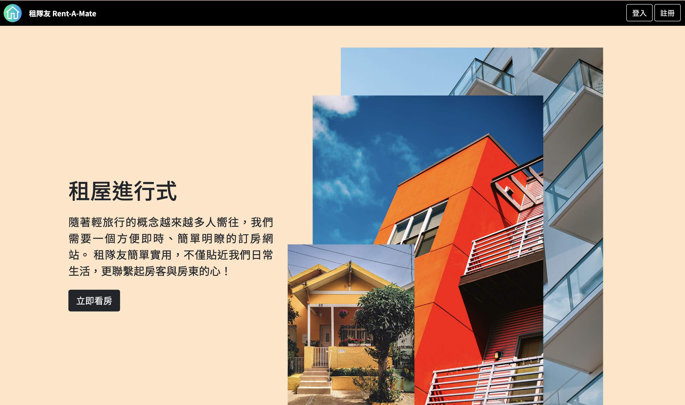
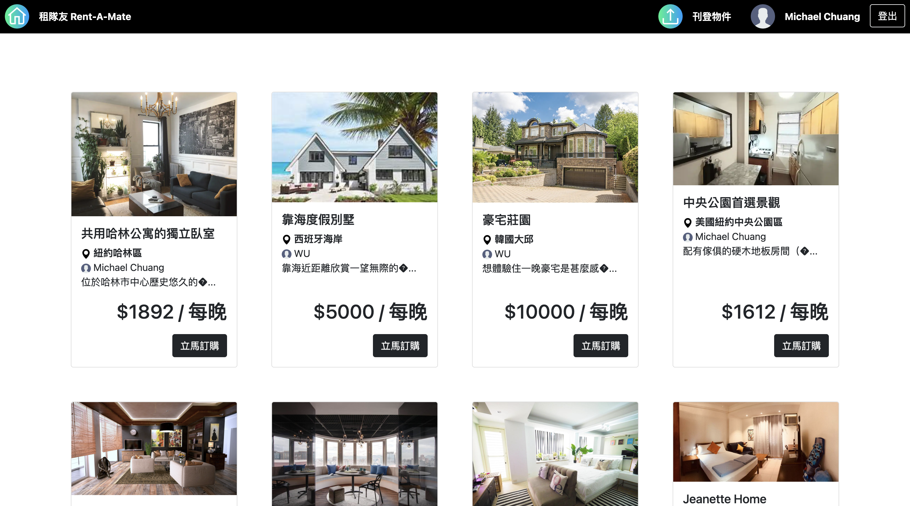
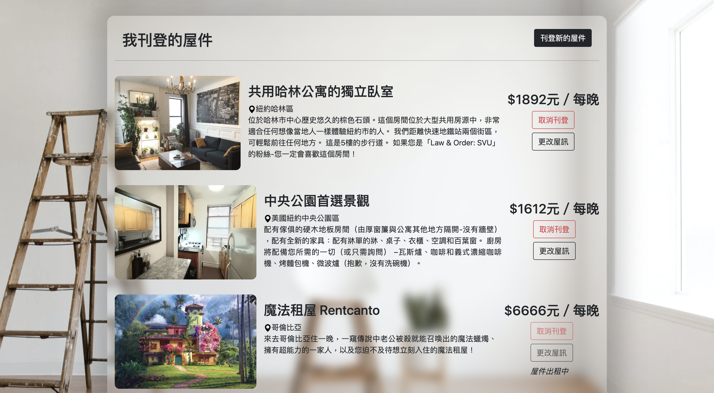
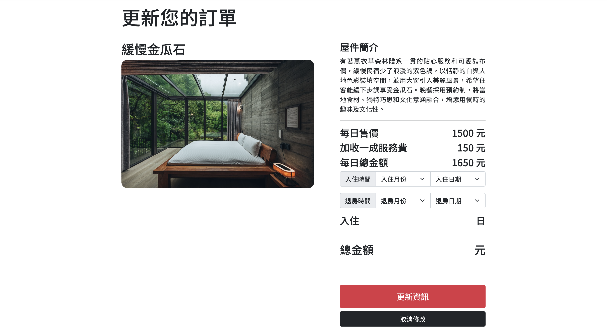

# 租隊友 Rent-A-Mate

我們相信租房子應該是一件輕鬆簡單的事，因此我們打造了[租隊友 Rent-A-Mate](https://rent-a-mate.herokuapp.com/) 。 
這是一個十分直覺的 C2C 線上房屋出租與下單平台，無論您是租客或者房東，都一定能在這裡擁有良好的體驗。

## 網站特色
* 刊登、下單、管理一站式服務 👏
* 瀏覽屋件免登入，看到尬意的再註冊！
* 售價區間選擇服務 💵 適合精打細算的你
* 貼心提供房東後台系統，更新屋件資料好便利 😻
* 訂了房卻被老闆要加班？租隊友讓你無痛更改訂單入住期間 👻
* 只收一成服務費！

讓租隊友成為你最給力的租屋神隊友，現在立即瀏覽 [https://rent-a-mate.herokuapp.com/](https://rent-a-mate.herokuapp.com/) 來成為我們的一員吧！

## 作品介紹
本產品為資科系期末專題作品，以 PHP 撰寫並串接 MySQL 資料庫來實現。

**以下為本作品使用到的語言 / 工具：**
* HTML / CSS
* PHP
* MySQL
* JavaScript 、 jQuery
* Bootstrap 5
* Git
* Heroku

**以下為我們在發想所提出產品需具備，且有成功實踐的的技術訴求：**
- 身份驗證系統
- 交易系統
- 用戶上架產品系統
- 後台管理系統

**以下是礙於時間以及技術不足等因素，未能實現的功能：**
- 上傳圖片功能
- 屋件類別 / 標籤功能
- 追蹤清單 / 購物籃功能
- 用戶評論系統
- 刊登多張屋件圖像功能
- 後端密碼 hashing 與 salting
- [更多彩蛋](https://youtu.be/dQw4w9WgXcQ)

我們在有限的開發期間內學習到了許多寶貴的經驗與知識；即使如此，我們認為「租隊友」仍有很大的改善空間。 
如果未來有機會繼續開發這個作品的話，以上幾點會是我希望可以首先被改善的。

## 了解更多
若您對本作品感興趣，歡迎參訪以下連結了解更多：
* [體驗租隊友服務](https://rent-a-mate.herokuapp.com/)
* [專題企劃書](https://docs.google.com/presentation/d/1e0ffrRQENIpJt2ZW6IAH-BKGnpZ3mQmffFPoZhEqSm8/edit?usp=sharing)
* [RAM Wirefram](https://whimsical.com/ram-YTskLpMFG6a5HZAzjorJ4)
* [RAM Diagram](https://miro.com/app/board/uXjVOwr4cqY=/?share_link_id=323276862411)
* [介紹影片](https://youtu.be/HGWa5t9bKm8)

## 開發團隊
本專題由四人共同構想、貢獻：
* **莊天均（[LinkedIn](https://www.linkedin.com/in/zhsont/)）**
    * 主導產品開發
    * 前後端架構
    * 產品核心功能（登入、註冊、下單、刊登、更新、刪除）
    * 資料庫架構
* **吳俊翰**
    * 前後端架構發想
    * 登入與註冊系統發想
* **紀柔安**
    * 屋件價位過濾系統
    * 協助開發首頁
* **簡銘輝**
    * 協助開發屋件瀏覽系統

## 結語

謝謝教授、組員們這學期的提攜與指教，也謝謝開發期間每一位協助測試的朋友們，你們的真誠回饋就是我製作出更有趣、實用產品的動力。 
在這份專題告一段落之際，除了深深感到自己的技術力仍過於淺薄，也深刻地體會到了建構互動性網頁服務是多麼好玩的一件事。 
最後，也謝謝點進來閱讀這個 repository 的您。若對這個產品有任何疑問或是建議，還請不吝透過 `zhsont`at`gmail.com` 聯繫我，十分感謝。
